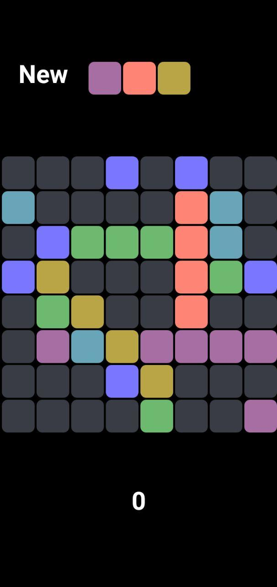

##### Classical Game The Lines
for Android
###### Contents of game interface
* field matrix field 8 x 8
* button New starting new game
* block with 3 random bubbles to be dropped on the field next
* score indicator

###### Rules
* Assemble lines and score
* Line should be of 5 or more like coloured "bubbles"
* Points for line equal number bubbles in it
* Line can be ether horizontal, vertical or diagonal or combination of them
* Every action not leading to assembling a line leads to rise of chaos
new bubbles appear on the field in random positions

###### Please play and enjoy

